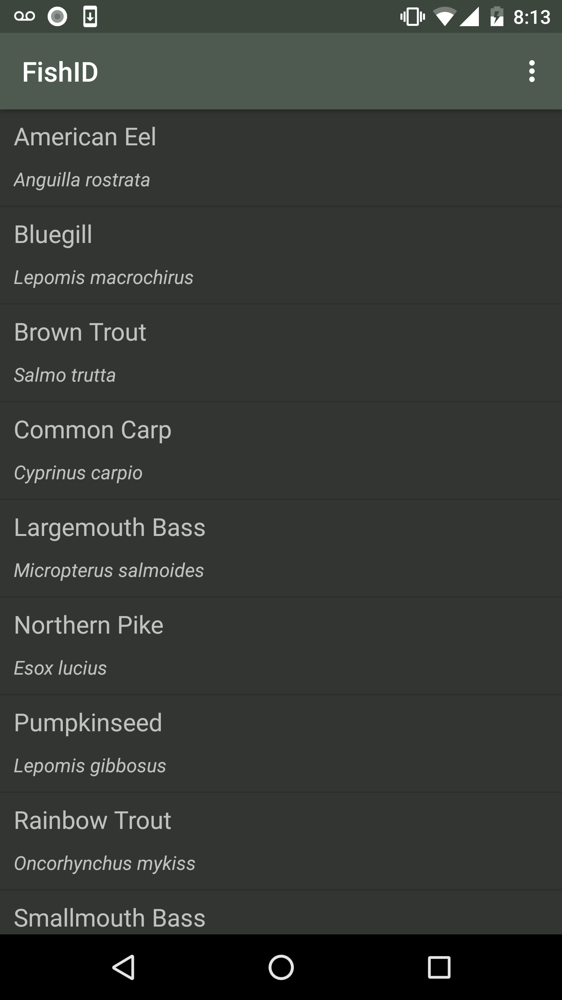
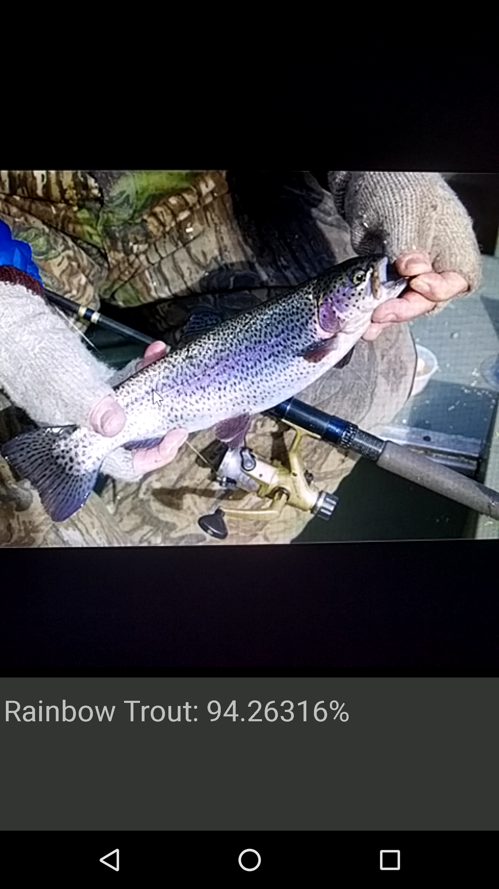

# FishID (0.0.1) Image Classifier

FishID is an image-recognition Android app built with TensorFlow.
It utilizes transfer learning from Google’s Inception-v3 image recognition model to classify common species of North American freshwater fish.

At the moment, it can classify 12 different species, but more will be added as development continues.

